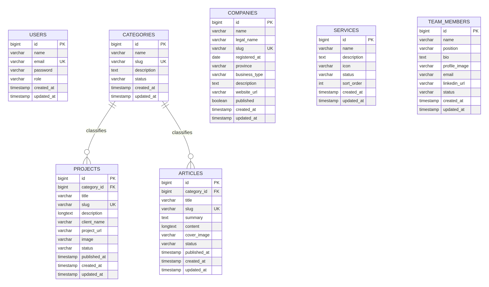

# MONSTOPIA CMS ER Diagram

ภาพด้านล่างแสดง schema หลักของ CMS โดย `categories` มีความสัมพันธ์แบบ one-to-many กับ `projects` และ `articles` ผ่าน `category_id` ส่วน `users`, `services`, `team_members` และ `companies` เป็นข้อมูลหลักของระบบที่จัดการผ่าน API ตามสิทธิ์ที่กำหนด



แหล่งต้นฉบับ Mermaid อยู่ที่ `docs/er_diagram.mmd` และสามารถ render ใหม่ได้ด้วย:

```bash
manus-render-diagram docs/er_diagram.mmd docs/er_diagram.png
```
